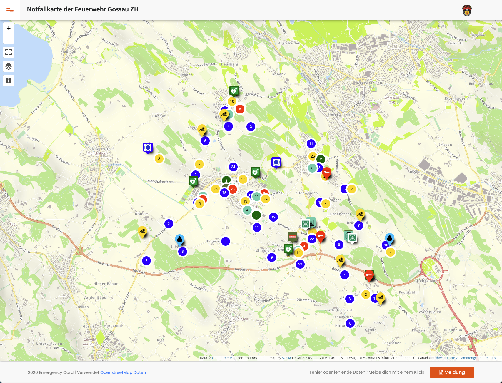
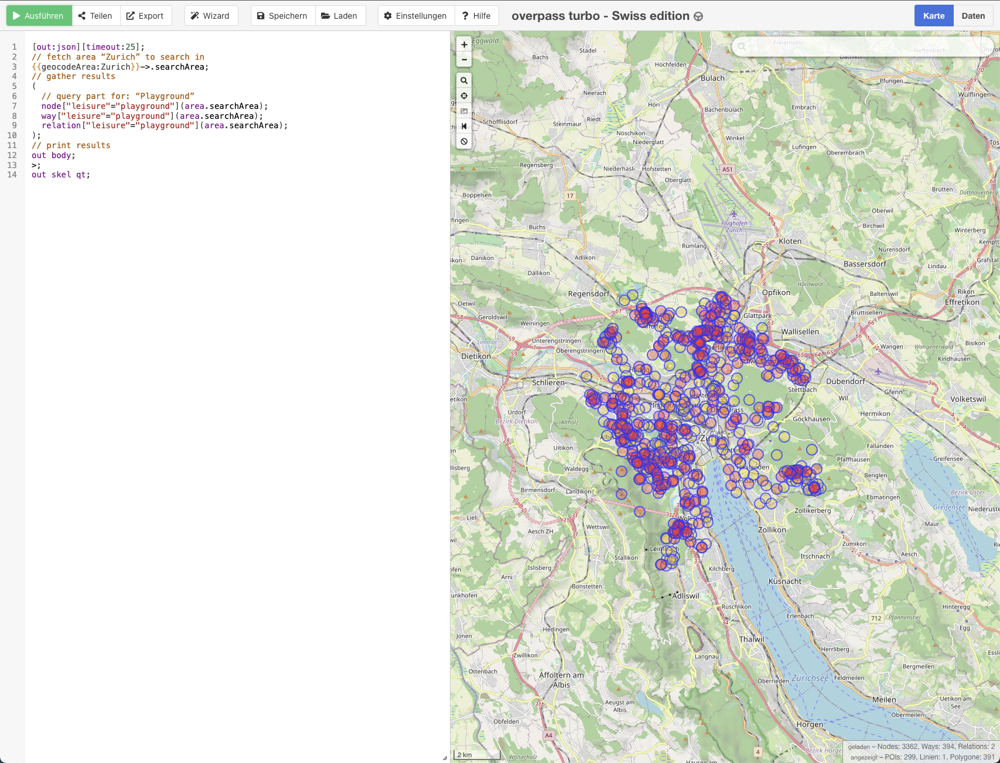

[LOGO OPENBRACKETS]

# Notfallkarte mit OpenStreetMap und uMap erstellen

## Einleitung

In dieser Anleitung zeigen wir dir wie du aus Daten von OpenStreetMap (OSM), uMap (einem Kartenframework) und einem HTML Wrapper eine Notfallkarte für deine Feuerwehr bauen kannst.

Als Anwendungsbeispiel, resp. Vorlage für dieses Tutorial gilt die Notfallkarte der Feuerwehr Gossau ZH.



## Vorwissen

Um eine gewisse Ahnung von OSM zu haben und auch einen gewissen Grundstock an feuerwehr-relevanten Daten in deiner Gemeinde zu haben, empfehlen wir dir, die Webseite Anleitung OSM für Feuerwehren {Link einfügen} zu konsultieren und als Erstes zu bearbeiten. Danach solltest du ein gewisses Grundwissen in der OSM-Welt haben und auch Daten, mit denen du produktiv arbeiten kannst.

## uMap Karte zusammenstellen

uMap ist ein Framework um sich eigene Kartendienste zu bauen, ähnlich Google Maps. Bei uMap kann man selber Punkte setzen und anlegen, jedoch auch direkt Live-OSM Daten abgreifen. Dazu greift man über Overpass Anfragen auf einen Server zu der OSM-Daten zu Verfügung stellt. Diese Abfragen sind teilweise recht kompliziert dargestellt, wenn man den Dreh aber etwas raus hat, dann kann man fast alles darstellen. Wir gehen unten auf Overpass und deren Abfragen weiter ein.

*Stehen geblieben hier*

## Was ist Overpass?

Overpass ist ein mächtiges Tool, das verwendet wird, um Informationen aus der OpenStreetMap (OSM)-Datenbank abzurufen. OpenStreetMap ist eine riesige, von Benutzern erstellte Karte der Welt, die viele verschiedene Arten von geografischen Informationen enthält, wie z. B. Straßen, Gebäude, Flüsse, Parks und vieles mehr.

Stell dir Overpass wie eine spezielle Suchmaschine für diese Karte vor. Wenn du nach bestimmten Informationen auf der Karte suchst, kannst du Overpass verwenden, um gezielt nach diesen Daten zu fragen.

Hier ist eine einfache Erklärung, wie Overpass funktioniert:

1. **Datenbank**: OpenStreetMap enthält eine riesige Menge an geografischen Daten, die von vielen freiwilligen Benutzern weltweit gesammelt und gepflegt werden.

2. **Abfragesprache**: Overpass nutzt eine spezielle Abfragesprache, die „Overpass QL“ (Query Language) genannt wird. Mit dieser Sprache kannst du genau festlegen, welche Daten du aus der OSM-Datenbank extrahieren möchtest.

3. **Abfragen**: Du schreibst eine Abfrage in Overpass QL, um bestimmte Informationen zu finden. Zum Beispiel könntest du nach allen Spielplätzen in einer Stadt oder nach allen Straßen mit Radwegen suchen.

4. **Ergebnisse**: Overpass führt deine Abfrage aus und gibt dir die gewünschten Daten zurück. Diese Daten kannst du dann auf einer Karte anzeigen oder für andere Anwendungen nutzen.

Ein einfaches Beispiel für eine Overpass-Abfrage wäre:

```overpassql
[out:json][timeout:25];
// fetch area “Zurich” to search in
{{geocodeArea:Zurich}}->.searchArea;
// gather results
(
  // query part for: “Playground”
  node["leisure"="playground"](area.searchArea);
  way["leisure"="playground"](area.searchArea);
  relation["leisure"="playground"](area.searchArea);
);
// print results
out body;
>;
out skel qt;
```

Diese Abfrage sucht nach allen Knotenpunkten (node) mit der Eigenschaft „amenity=playground“ (also Spielplätze) innerhalb des Gebiets Zürich und gibt die Ergebnisse im JSON-Format zurück.



Insgesamt ist Overpass also ein Werkzeug, das dir hilft, gezielt Informationen aus der umfangreichen OpenStreetMap-Datenbank herauszufiltern und zu nutzen.

## Daten und deren Bedeutungen

Im Feuerwehr-Kontext sind folgende Daten vermutlich interessant, dies ist aber aus Sicht des Autors. Es kann gut sein dass gemeindespezifisch andere Daten relevant sein könnten.

Für die Gossauer Karte wurden folgende Daten verwendet.

| key | tag | Beschreibung | OSM Wiki
|- |- |-|-
| emergency | defibrillator| Defibrillatoren | https://wiki.openstreetmap.org/wiki/Tag%3Aemergency%3Ddefibrillator
| emergency | fire_hydrant | Hydranten | https://wiki.openstreetmap.org/wiki/Tag:emergency%3Dfire_hydrant
| emergency | assembly_point | Evakuierungspunkte / Sammelplätze | https://wiki.openstreetmap.org/wiki/Tag:emergency%3Dassembly_point
| emergency | key_depot | Schlüsseldepot Feuerwehr | 
| emergency | fire_control_panel| BMA Bedienstellen | 
| emergency:plan| yes | Feuerwehr Einsatzplan
| emergency | siren | ZSO Sirene | https://wiki.openstreetmap.org/wiki/Tag%3Aemergency%3Dsiren
| emergency | disaster_help_point | Notfalltreffpunkte | https://wiki.openstreetmap.org/wiki/Tag%3Aemergency%3Ddisaster_help_point
| emergency | fire_water_pond | Löschwasserbecken | https://wiki.openstreetmap.org/wiki/Tag%3Aemergency%3Dfire_water_pond

**Solaranlagen mit folgenden Tags versehen:**
```
generator:method=photovoltaic
generator:output:electricity=small_installation
generator:place=roof
generator:source=solar
generator:type=solar_photovoltaic_panel
power=generator
```


## HTML Wrapper für Feuerwehr

Den HTML Wrapper findet ihr hier: {LINK ZU GITHUB}

## Domain verbinden und hochladen

## nützliche Links

- Notfallkarte Gossau ZH {Link einfügen}
- Anleitung OSM für Feuerwehren {Link einfügen}
- OpenSchoolMaps - Schulung für uMap {Link einfügen} https://openschoolmaps.ch/lehrmittel/umap/karten-im-web-veroeffentlichen.html